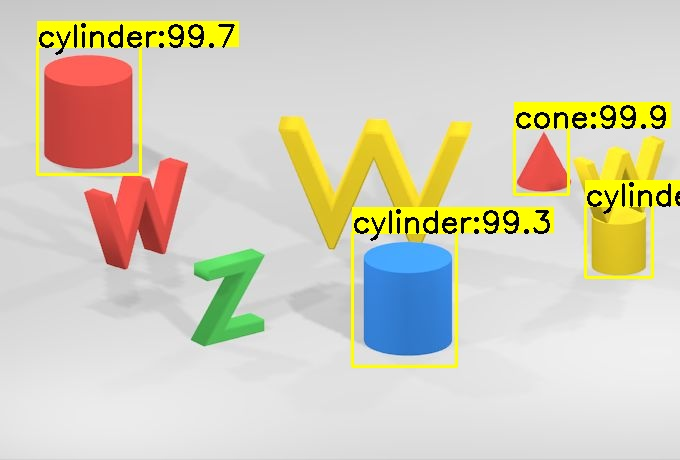

## Describe

The captcha geometry recognition model based on yolo can currently only recognize geometry types such as cylinders, spheres, cones, cubes, etc. If you need to recognize more types of geometry such as numbers and letters, you can use this model as a pre-training model to retrain.

## Use this model

Download the ```.h5``` model and ```detection_config.json```[in here](https://github.com/01miaom/clevr/releases), and place these two files in the same folder as the image and script, then run the following code in script:

```python
import cv2
import numpy as np
from imageai.Detection.Custom import CustomObjectDetection

image_name = 'input.jpg'
detector = CustomObjectDetection()
detector.setModelTypeAsYOLOv3()
detector.setModelPath("detection_model-ex-060--loss-0011.123.h5")
detector.setJsonPath("=detection_config.json")
detector.loadModel()
detections = detector.detectObjectsFromImage(input_image=image_name, output_image_path="output.jpg")
percentage = []
box = []
objectName = []
for detection in detections:
    print(detection["name"], " : ", detection["percentage_probability"], " : ", detection["box_points"])
    percentage.append(detection["percentage_probability"])
    box.append( detection["box_points"])
    objectName.append(detection["name"])


def nms(bounding_boxes, confidence_score, threshold):
    # If no bounding boxes, return empty list
    if len(bounding_boxes) == 0:
        return [], []

    # Bounding boxes
    boxes = np.array(bounding_boxes)

    # coordinates of bounding boxes
    start_x = boxes[:, 0]
    start_y = boxes[:, 1]
    end_x = boxes[:, 2]
    end_y = boxes[:, 3]

    # Confidence scores of bounding boxes
    score = np.array(confidence_score)

    # Picked bounding boxes
    picked_boxes = []
    picked_score = []
    picked_name = []

    # Compute areas of bounding boxes
    areas = (end_x - start_x + 1) * (end_y - start_y + 1)
     # Sort by confidence score of bounding boxes
    order = np.argsort(score)

    # Iterate bounding boxes
    while order.size > 0:
        # The index of largest confidence score
        index = order[-1]

        # Pick the bounding box with largest confidence score
        picked_boxes.append(bounding_boxes[index])
        picked_score.append(confidence_score[index])
        picked_name.append(objectName[index])

        # Compute ordinates of intersection-over-union(IOU)
        x1 = np.maximum(start_x[index], start_x[order[:-1]])
        x2 = np.minimum(end_x[index], end_x[order[:-1]])
        y1 = np.maximum(start_y[index], start_y[order[:-1]])
        y2 = np.minimum(end_y[index], end_y[order[:-1]])

        # Compute areas of intersection-over-union
        w = np.maximum(0.0, x2 - x1 + 1)
        h = np.maximum(0.0, y2 - y1 + 1)
        intersection = w * h

        # Compute the ratio between intersection and union
        ratio = intersection / (areas[index] + areas[order[:-1]] - intersection)

        left = np.where(ratio < threshold)
        order = order[left]

    return picked_boxes, picked_score, picked_name


# Bounding boxes
bounding_boxes = box
confidence_score = percentage

# Read image
image = cv2.imread(image_name)

# Copy image as original
org = image.copy()

# Draw parameters
font = cv2.FONT_HERSHEY_SIMPLEX
font_scale = 1
thickness = 2

# IoU threshold
threshold = 0.4


# Run non-max suppression algorithm
picked_boxes, picked_score, picked_name = nms(bounding_boxes, confidence_score, threshold)

# Draw bounding boxes and confidence score after non-maximum supression
for (start_x, start_y, end_x, end_y), confidence, names in zip(picked_boxes, picked_score, picked_name):
    string = str(confidence)
    label = names+":"+string[0:4]
    (w, h), baseline = cv2.getTextSize(label, font, font_scale, thickness)
    cv2.rectangle(image, (start_x, start_y - (2 * baseline + 5)), (start_x + w, start_y), (0, 255, 255), -1)
    cv2.rectangle(image, (start_x, start_y), (end_x, end_y), (0, 255, 255), 2)
    cv2.putText(image, label, (start_x, start_y), font, font_scale, (0, 0, 0), thickness)

# Save image
cv2.imwrite('nms.jpg',image)
cv2.waitKey(0)
```

## Train the model yourself

- How to Label Data

Data annotation can refer to the following open source projects. After the annotation, an xml file corresponding to the image will be generated.

https://github.com/tzutalin/labelImg

- How to train a model

https://github.com/OlafenwaMoses/ImageAI/blob/master/imageai/Detection/Custom/CUSTOMDETECTIONTRAINING.md

- How to use an already trained model

https://github.com/OlafenwaMoses/ImageAI/blob/master/imageai/Detection/Custom/CUSTOMDETECTION.md

## Credits

- open-source: https://github.com/tzutalin/labelImg
- open-source: https://github.com/OlafenwaMoses/ImageAI
